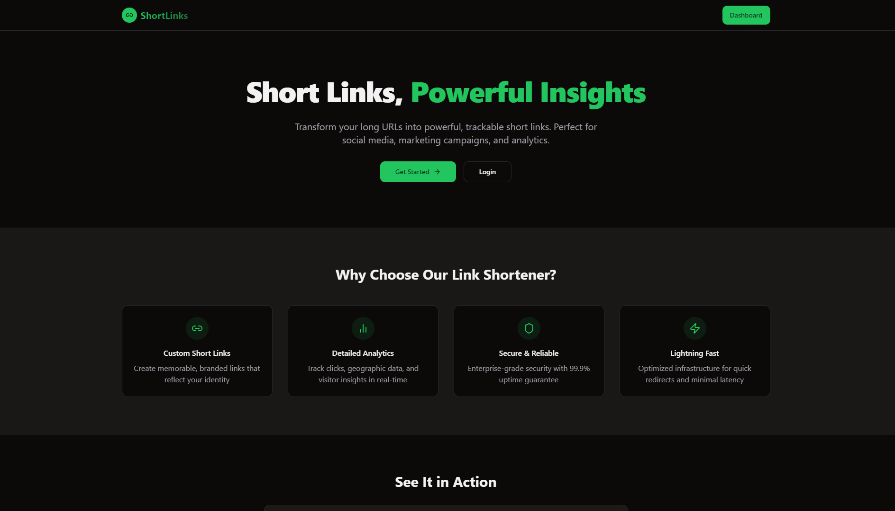
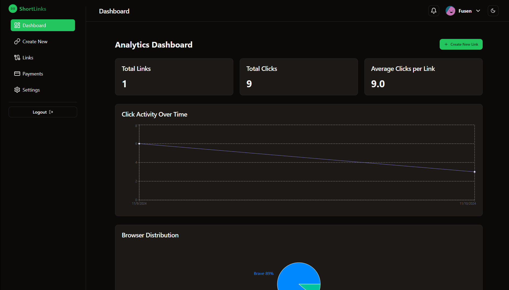

# ShortLinks
ShortLinks is a free and open source URL shortener.

# Screenshots

 

## Features
- Shorten links
- Custom short slugs
- Edit links data
- View analytics

## Installation
1. Clone the repository
2. Run `npm install`
3. Run `npm run dev`
4. Open http://localhost:3000 in your browser

